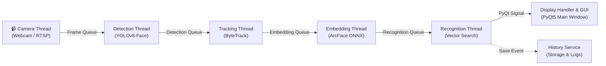

# Real-Time Multi-Threaded Face Recognition System

<p align="center">
  
  
  
  
  
  
  <a href="https://github.com/tuanhm2112"></a>
</p>

---

## Tổng quan dự án (Overview)

**Real-Time Face Recognition System** là hệ thống nhận diện khuôn mặt thời gian thực hiệu năng cao, được thiết kế theo kiến trúc **đa luồng (Multi-threaded Pipeline)** với giao diện đồ họa trực quan xây dựng trên **PyQt5**. 

Hệ thống tích hợp các mô hình Deep Learning tiên tiến nhất:
- **Face Detection:** YOLOv8-Face phát hiện khuôn mặt với độ trễ thấp và độ chính xác cao ngay cả trong điều kiện góc nghiêng, ánh sáng yếu.
- **Face Tracking:** ByteTrack duy trì định danh (Track ID) liên tục qua các frame hình, giảm thiểu tình trạng nhận diện nhấp nháy (flickering).
- **Face Recognition:** ArcFace (InsightFace ResNet-50) trích xuất vector đặc trưng 512 chiều chuẩn hóa kết hợp thuật toán Cosine Similarity để đối soát định danh tức thì.

---

## Kiến trúc xử lý đa luồng (Pipeline Architecture)

Hệ thống tách biệt hoàn toàn các tác vụ vào các worker thread độc lập (`QThread`) giao tiếp qua hàng đợi `queue.Queue` với cơ chế điều tiết bộ đệm (Backpressure handling) nhằm duy trì FPS ổn định và tránh giật lag giao diện:



---

## Tính năng nổi bật (Key Features)

- [x] **Nguồn camera linh hoạt:** Hỗ trợ cả Webcam máy tính (USB/Built-in) và luồng camera IP (RTSP/RTMP).
- [x] **Nhận diện khuôn mặt theo thời gian thực:** Pipeline 5 giai đoạn chạy song song, tận dụng tối đa GPU CUDA.
- [x] **Quản lý danh tính (Face Database):** Thêm người mới trực tiếp từ camera, hỗ trợ chụp nhiều góc ảnh, trích xuất và lưu trữ embedding tự động.
- [x] **Nhật ký & Lịch sử nhận diện:** Tự động chụp và lưu lại ảnh khuôn mặt theo từng ngày kèm mốc thời gian chi tiết; tích hợp giao diện tìm kiếm và lọc lịch sử.
- [x] **Bảng điều khiển động (Settings Dialog):** Tinh chỉnh ngưỡng nhận diện (*Detection Confidence*, *Recognition Threshold*), độ phân giải, nguồn camera và giao diện mà không cần khởi động lại ứng dụng.
- [x] **Giao diện người dùng hiện đại:** Hỗ trợ chuyển đổi mượt mà giữa **Dark Theme** và **Light Theme**.
- [x] **Bảo mật & Chuẩn GitHub:** Dữ liệu cá nhân, nhật ký khuôn mặt và file trọng số lớn (>100MB) được tách biệt an toàn theo chuẩn mã nguồn mở.

---

## Cấu trúc thư mục dự án (Project Structure)

```text
Face_v3_0410/
├── .github/
│   └── workflows/
│       └── lint_test.yml          # GitHub Actions CI kiểm tra mã nguồn tự động
├── main_app/                      # Package chính của ứng dụng
│   ├── core/                      # Bộ điều phối trung tâm
│   │   ├── model_manager.py       # Quản lý khởi tạo mô hình AI
│   │   └── thread_manager.py      # Điều phối pipeline đa luồng và các queues
│   ├── gui/                       # Giao diện người dùng (PyQt5)
│   │   ├── main_window.py         # Màn hình chính
│   │   ├── add_person_dialog.py   # Hộp thoại đăng ký thêm người mới
│   │   ├── settings_dialog.py     # Hộp thoại cấu hình cài đặt
│   │   └── history_dialog.py      # Hộp thoại tra cứu lịch sử nhận diện
│   ├── models/                    # Lớp bọc mô hình AI (Model wrappers)
│   │   ├── arcface_model.py       # Wrapper trích xuất đặc trưng ArcFace
│   │   └── facenet_model.py       # Wrapper FaceNet (tuỳ chọn)
│   ├── services/                  # Nghiệp vụ logic (Business logic)
│   │   ├── face_capture_service.py
│   │   ├── face_embedding_service.py
│   │   ├── history_service.py     # Quản lý lưu/đọc dữ liệu nhận diện
│   │   └── person_service.py      # Quản lý danh tính (CRUD)
│   ├── threads/                   # Các luồng worker độc lập (QThread)
│   │   ├── camera_thread.py       # Luồng đọc camera
│   │   ├── detection_thread.py    # Luồng phát hiện khuôn mặt
│   │   ├── tracking_thread.py     # Luồng theo dõi đối tượng
│   │   ├── embedding_thread.py    # Luồng tạo vector đặc trưng
│   │   ├── recognition_thread.py  # Luồng so khớp danh tính
│   │   └── display_thread.py      # Bộ xử lý vẽ và hiển thị frame
│   ├── utils/                     # Tiện ích bổ trợ (Logger, Config, Styles)
│   ├── widgets/                   # Các widget giao diện tuỳ biến
│   └── app.py                     # Bộ khởi chạy ứng dụng chính
├── resources/                     # Tài nguyên của hệ thống
│   ├── config/
│   │   ├── config.yaml            # Cấu hình hiện thời
│   │   └── config.example.yaml    # File mẫu cấu hình chuẩn
│   ├── data/
│   │   ├── identities.example.json# File mẫu định dạng cơ sở dữ liệu khuôn mặt
│   │   └── persons/               # Thư mục lưu ảnh khuôn mặt đã đăng ký
│   ├── face_history/              # Thư mục lưu vết nhận diện theo ngày
│   ├── styles/                    # Giao diện QSS (dark_theme, light_theme)
│   └── weights/                   # Thư mục chứa trọng số mô hình
│       └── README.md              # Hướng dẫn tải trọng số YOLOv8 & ArcFace
├── scripts/                       # Các kịch bản tiện ích & kiểm thử
│   ├── benchmark_similarity.py    # Đo lường và kiểm tra độ tương đồng Cosine
│   └── download_weights.py        # Kịch bản kiểm tra & tự động tải mô hình
├── tests/                         # Bộ kiểm thử đơn vị (Unit Tests)
│   └── test_config.py
├── .gitattributes                 # Chuẩn hóa định dạng dòng (Line endings)
├── .gitignore                     # Bỏ qua logs, weights >100MB, dữ liệu cá nhân
├── LICENSE                        # Giấy phép mã nguồn mở MIT
├── main.py                        # Điểm khởi chạy ứng dụng
├── pyproject.toml                 # Thông số đóng gói tiêu chuẩn Python
└── requirements.txt               # Danh sách thư viện phụ thuộc
```

---

## Hướng dẫn cài đặt & Chạy dự án (Getting Started)

### 1. Yêu cầu hệ thống (System Prerequisites)
- **Hệ điều hành:** Windows 10/11, Ubuntu 20.04+, hoặc macOS.
- **Python:** 3.9 - 3.11 (Khuyến nghị **Python 3.10** hoặc **3.11**).
- **Phần cứng:** 
  - Khuyến nghị có GPU **NVIDIA** (hỗ trợ CUDA) để đạt tốc độ xử lý trên 30+ FPS.
  - Vẫn hỗ trợ chế độ **CPU** (cấu hình trong `config.yaml`).

### 2. Cài đặt môi trường ảo (Virtual Environment)
```bash
# Clone repository về máy
git clone https://github.com/tuanhm2112/face-recognition-system.git
cd face-recognition-system

# Tạo môi trường ảo
python -m venv .venv

# Kích hoạt môi trường (Windows PowerShell)
.venv\Scripts\Activate.ps1

# Kích hoạt môi trường (Linux / macOS)
source .venv/bin/activate
```

### 3. Cài đặt các thư viện cần thiết (Dependencies)

#### Chạy với GPU (NVIDIA CUDA):
```bash
# 1. Cài đặt PyTorch với CUDA tương ứng (ví dụ CUDA 12.1)
pip install torch torchvision --index-url https://download.pytorch.org/whl/cu121

# 2. Cài đặt các thư viện còn lại
pip install -r requirements.txt
pip install onnxruntime-gpu
```

#### Chạy với CPU:
```bash
pip install -r requirements.txt
pip install onnxruntime
```

---

## Thiết lập trọng số mô hình (Model Weights Setup)

Vì kích thước file trọng số vượt quá giới hạn **100 MB** của GitHub, file `.pt` và `.onnx` không lưu trữ trực tiếp trên Git repo. Bạn có thể kiểm tra và tải về tự động:

```bash
python scripts/download_weights.py
```

Hoặc tải thủ công theo bảng sau và đặt vào thư mục `resources/weights/`:

| Mô hình | Tên file lưu tại `resources/weights/` | Tải về |
| :--- | :--- | :--- |
| **YOLOv8m Face** | `yolov8m-face-lindevs.pt` | [Tải từ Hugging Face](https://huggingface.co/arnabdhar/YOLOv8-Face-Detection/resolve/main/model.pt) |
| **ArcFace ResNet-50** | `w600k_r50.onnx` | [Tải từ Hugging Face (InsightFace)](https://huggingface.co/public-data/insightface/resolve/main/models/buffalo_l/w600k_r50.onnx) |

---

## Hướng dẫn sử dụng (Usage)

### 1. Khởi chạy giao diện chính
```bash
python main.py
```

### 2. Kiểm thử độ tương đồng Cosine giữa 2 ảnh khuôn mặt
```bash
# Chế độ tương tác
python scripts/benchmark_similarity.py

# Hoặc truyền trực tiếp đường dẫn 2 ảnh
python scripts/benchmark_similarity.py --img1 "path/to/face1.jpg" --img2 "path/to/face2.jpg"
```

### 3. Chạy kiểm thử tự động (Unit Tests)
```bash
python -m unittest discover -s tests
```

---

## Cấu hình hệ thống (Configuration)

Tất cả thông số vận hành được quản lý tập trung trong file [resources/config/config.yaml](resources/config/config.yaml):

```yaml
camera:
  source_type: local              # "local" (Webcam) hoặc "rtmp" (RTSP stream)
  camera_index: 0                 # Chỉ số cổng camera local (0 là camera mặc định)
  fps: 30
  resolution: [1280, 720]
  stream_url: ""                  # Điền RTSP URL nếu source_type là rtmp

models:
  face_detection:
    detection_confidence: 0.60    # Ngưỡng tin cậy phát hiện khuôn mặt
  face_recognition:
    recognition_threshold: 0.50   # Ngưỡng khoảng cách nhận dạng (Cosine Similarity)

runtime:
  device: cuda                    # "cuda" hoặc "cpu"
  num_threads: 6
  log_level: INFO

ui:
  theme: dark                     # "dark" hoặc "light"
```

---


## Bản quyền (License)

Dự án được phân phối dưới giấy phép **MIT License**. Xem chi tiết tại tệp [LICENSE](LICENSE).

---

## Tác giả (Author)

- **GitHub:** [@tuanhm2112](https://github.com/tuanhm2112)
- **Email:** tuanhm211224@gmail.com
- **Dự án:** Real-Time Face Recognition Desktop Application
